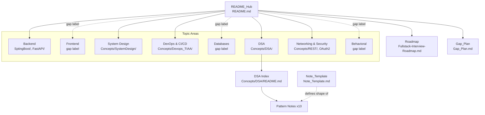

# Design Document

## Overview

This feature reorganizes the `sxv-personal` repository into a navigable interview-prep knowledge base. It is a **documentation and knowledge-organization** effort: there is no application runtime. The "system" is the repository itself — its folder layout, Markdown files, headings, and the relative links between them. Correctness is therefore about **structural invariants** (every cross-link resolves, every DSA pattern has exactly one note, every note follows the template) rather than runtime behavior.

The design delivers five concrete artifacts on top of the existing content:

1. A **README hub** (`README.md`) that replaces the current one-line stub with a categorized, priority-ranked navigation index.
2. A **DSA section** at `Concepts/DSA/` containing 10 pattern notes plus an index, each pattern note following a fixed content structure.
3. A **Note_Template** (`Note_Template.md`) that defines the common shape all normalized notes adopt.
4. A **Gap_Plan** (`Gap_Plan.md`) that prioritizes missing topics with target paths.
5. **Cross-link conventions** and a **consistency-maintenance** approach that keeps the hub, indexes, and Roadmap accurate as content changes.

The design maps directly to the six requirements. Because the deliverables are files rather than executable code, the Correctness Properties section defines invariants that a lightweight **structural checker** can validate by walking the repository (enumeration), and the Testing Strategy describes how that checker is organized.

### Research Notes (grounding from the existing repository)

- The current `README.md` is a single line (`# sxv-personal`), so the hub is built from scratch.
- `Fullstack-Interview-Roadmap.md` already defines **8 topic areas** (Backend, Frontend, System Design, DevOps & CI/CD, Databases, DSA, Networking & Security, Behavioral), a **Priority Order** block, and a **Gaps to Fill** table with priorities and suggested files. These are reused as the source of truth for the hub index, priority ranking, and Gap_Plan seed data.
- Existing notes (`Concepts/SystemDesign/KAFKA.md`, `Concepts/REST/list-of-REST-api-concepts.md`) already follow a `#` title → `##` section convention, which the Note_Template formalizes. Some files (e.g., `SptingBoot/layeredArchitecture.md`) have **no top-level title** — these are the primary normalization targets.
- The top-level folders today are: `2026/`, `Concepts/`, `english/`, `FastAPI/`, `Gradle/`, `SptingBoot/` (misspelled). `Concepts/` contains `Devops_TIAA/`, `REST/`, `SystemDesign/`.
- The misspelled `SptingBoot` folder is recorded as an inconsistency in the Gap_Plan (Requirement 4.6) rather than renamed as part of this feature, to avoid breaking the many Roadmap links that already point at it.

## Architecture

The repository is organized as a **hub-and-spoke navigation graph** layered over the file tree.



Key architectural decisions:

- **Single entry point.** `README.md` is the only hub a reader must open first. Every topic area is reachable from it in one hop (to a folder or section index) or is explicitly marked as a gap.
- **Section indexes for dense folders.** Folders with several notes (notably `Concepts/DSA/`) get a local index file (`README.md` inside the folder) so the top-level hub stays compact and links point at the index rather than enumerating every file.
- **Roadmap as coverage source of truth.** The Roadmap already tracks coverage (✅/❌) and priority. The hub and Gap_Plan derive from it, and the consistency rules keep the three in sync.
- **Relative links only.** All cross-links are repository-relative Markdown links so the graph is valid when the repo is cloned or viewed on any host.
- **Additive normalization.** Normalization adds structure (title, summary, H2 headings) without deleting existing technical content, preserving the value already captured.

## Components and Interfaces

### Component 1: README Hub (`README.md`)

Repurposes the stub into the navigation hub. Layout (top to bottom):

1. **Title + one-line purpose.**
2. **Topic Index** — a table or list with one row per the 8 canonical topic areas. Each row is either a resolving cross-link (topic has notes) or a visible gap label such as `_(no notes yet)_` (topic has none).
3. **Preparation Priority** — an ordered (numbered) list ranking all 8 topic areas high-to-low, seeded from the Roadmap's Priority Order block.
4. **Repository Map** — a list naming every top-level folder (`2026/`, `Concepts/`, `english/`, `FastAPI/`, `Gradle/`, `SptingBoot/`).
5. **Key Documents** — exactly one link to the Roadmap, plus links to the Gap_Plan and Note_Template.

Canonical topic-area → target mapping (source of truth for index rows):

| Topic Area | Has notes? | Target |
|---|---|---|
| Backend | yes | `SptingBoot/`, `FastAPI/FastAPI.md` |
| Frontend | no | gap label |
| System Design | yes | `Concepts/SystemDesign/` |
| DevOps & CI/CD | yes | `Concepts/Devops_TIAA/DevOps-Tools-Concepts.md` |
| Databases | no | gap label |
| Data Structures & Algorithms | yes (new) | `Concepts/DSA/README.md` |
| Networking & Security | yes | `Concepts/REST/`, `2026/Tech/OAuth2.txt` |
| Behavioral | no | gap label |

### Component 2: DSA Section (`Concepts/DSA/`)

- One folder `Concepts/DSA/`.
- One **index** file `Concepts/DSA/README.md` linking to each pattern note exactly once.
- Ten **pattern notes**, one per canonical pattern:

| Pattern | File |
|---|---|
| Sliding Window | `Sliding-Window.md` |
| Two Pointers | `Two-Pointers.md` |
| Fast and Slow Pointers | `Fast-And-Slow-Pointers.md` |
| Binary Search | `Binary-Search.md` |
| Breadth-First Search | `Breadth-First-Search.md` |
| Depth-First Search | `Depth-First-Search.md` |
| Backtracking | `Backtracking.md` |
| Dynamic Programming | `Dynamic-Programming.md` |
| Greedy | `Greedy.md` |
| Top-K Elements | `Top-K-Elements.md` |

### Component 3: Note_Template (`Note_Template.md`)

Defines the common note shape (see Data Models). Serves as the reference authors copy when creating or normalizing notes.

### Component 4: Gap_Plan (`Gap_Plan.md`)

A prioritized table of missing topics plus a separate **Inconsistencies** section (for the `SptingBoot` misspelling and any files that cannot be normalized). Seeded from the Roadmap's "Gaps to Fill" table so priorities stay consistent.

### Component 5: Structural Checker (validation harness)

A small script (language chosen to match repo tooling; a Node or Python script under a `scripts/` or `.kiro` location) that walks the repository and evaluates the correctness properties. Its interface:

- **Input:** repository root path.
- **Output:** a list of findings, each `{ property, sourceFile, detail }`; empty list means compliant.
- **Behavior for Requirement 2.6:** any unresolved cross-link is emitted as a finding naming the unresolved target and its source Notes_File.

This checker is the executable expression of the invariants below; it is run manually or in CI, not as part of any application.

## Data Models

### Note_Template structure

```
# <Single Top-Level Title>            (exactly one H1)

<Summary: 1–5 sentences, ≤ 500 characters, no heading>

## <Section 1>                         (every content section is an H2)
...
## <Section N>
```

Rules:
- Exactly one first-level (`#`) title.
- A summary block of 1–5 sentences, ≤ 500 characters, placed immediately under the title with no intervening heading.
- One or more second-level (`##`) headings; all body content lives under an H2.

### Pattern_Note structure (extends Note_Template)

```
# <Pattern Name>

<Summary>

## When to Apply        (≥ 1 sentence describing problem conditions)
## Recognition Signals  (list of ≥ 2 trigger conditions)
## Worked Example       (≥ 1 problem statement sentence + a fenced code block ≥ 1 line)
## Practice Problems     (≥ 2 problems, each with a title)
## Complexity           (time and space, each in Big-O, e.g. Time: O(n), Space: O(1))
```

### DSA Index model

```
# Data Structures & Algorithms

<Summary>

## Patterns
- [Sliding Window](Sliding-Window.md)
- ... (exactly one link per pattern note; link count == note count == 10)
```

### Gap_Plan model

Each entry: `{ topic (unique), priority ∈ {High, Medium, Low}, targetPath (non-empty) }`, rows ordered High → Medium → Low. Required topics (minimum set): JPA & Hibernate, Testing (JUnit & Mockito), Java 8+ Features, Docker & Kubernetes, SQL & Database Design, Git branching strategies, Frontend basics.

```
# Content Gap Plan

## Prioritized Topics
| Priority | Topic | Target File |
|----------|-------|-------------|
| High     | JPA & Hibernate | SptingBoot/JPA-Hibernate.md |
| ...      | ...   | ... |

## Inconsistencies
- Folder `SptingBoot` is misspelled → proposed `SpringBoot`.
- <files that could not be normalized, if any>
```

### Cross_Link model

A Cross_Link is a relative Markdown link `[text](relative/path)`. It is **resolving** if `relative/path` (optionally with an anchor) exists as a file or folder in the repository, and **dangling** otherwise. Link integrity is defined over the set of all cross-links in hub, indexes, and notes.

### Topic coverage model (Roadmap ↔ repository)

A topic area is **covered** if at least one existing Notes_File maps to it. The Roadmap marks coverage with ✅ / ❌. Coverage consistency requires: topic has a linked note ⇒ Roadmap marks it covered.

## Correctness Properties

*A property is a characteristic or behavior that should hold true across all valid executions of a system — essentially, a formal statement about what the system should do. Properties serve as the bridge between human-readable specifications and machine-verifiable correctness guarantees.*

For this documentation feature the properties are **structural invariants over the repository state**. Each is universally quantified and is validated by the structural checker enumerating the relevant set (all cross-links, all pattern notes, all Gap_Plan rows, etc.) rather than by randomized input generation, because the input space is the fixed repository rather than an arbitrary value domain.

### Property 1: Link integrity (no dangling cross-links)

*For all* Cross_Links in the Repository (README hub, section indexes, and notes), the link target resolves to an existing file or folder; and for any link whose target does not exist, the checker reports it as non-compliant together with its source Notes_File.

**Validates: Requirements 1.6, 2.5, 2.6, 6.4, 6.5**

### Property 2: README topic-index completeness and uniqueness

*For all* eight canonical topic areas, each appears exactly once in the README index, and the index contains no topic-area entry outside the canonical set.

**Validates: Requirements 1.1**

### Property 3: README topic link-or-gap-label

*For all* topic areas in the README index: if the topic area has at least one existing Notes_File then its entry contains at least one resolving Cross_Link, and if it has none then its entry contains a visible gap label and no resolving note link.

**Validates: Requirements 1.3, 1.4**

### Property 4: README priority-order permutation

*For all* entries in the README preparation-priority list, the list is a permutation of the eight canonical topic areas — each topic area appears exactly once and no other entries are present.

**Validates: Requirements 1.5**

### Property 5: Single Roadmap link

*For* the README hub, exactly one Cross_Link resolves to the Roadmap file.

**Validates: Requirements 1.2**

### Property 6: README folder completeness

*For all* top-level folders in the Repository, the folder name appears in the README repository map.

**Validates: Requirements 6.3**

### Property 7: DSA pattern bijection

*For all* of the ten canonical DSA patterns, there is exactly one Pattern_Note dedicated to it, and *for all* Pattern_Notes in `Concepts/DSA/`, the note addresses exactly one canonical pattern (a one-to-one correspondence of size 10).

**Validates: Requirements 2.2**

### Property 8: DSA index link parity

*For all* Pattern_Notes in the DSA section, the DSA index contains exactly one Cross_Link to that note, the total count of index links equals the count of Pattern_Notes, and the README hub contains a Cross_Link resolving to the DSA index.

**Validates: Requirements 2.3, 2.4**

### Property 9: Pattern-note template conformance

*For all* Pattern_Notes, the note contains: a non-empty "When to Apply" section with ≥ 1 sentence; a "Recognition Signals" section listing ≥ 2 triggers; ≥ 1 worked example with a problem statement of ≥ 1 sentence and a code sample of ≥ 1 line; a "Practice Problems" section with ≥ 2 titled problems; and both time and space complexity stated in Big-O notation.

**Validates: Requirements 3.1, 3.2, 3.3, 3.4, 3.5**

### Property 10: Normalized-note conformance

*For all* normalized Notes_Files, the file contains exactly one top-level title, exactly one summary of 1–5 sentences not exceeding 500 characters, and one or more second-level headings.

**Validates: Requirements 4.2**

### Property 11: Content preservation under normalization

*For all* code blocks, commands, and defined terms present in a Notes_File before normalization, the same text is present unchanged after normalization.

**Validates: Requirements 4.3**

### Property 12: Gap_Plan completeness and uniqueness

*For all* topics in the Gap_Plan, each appears exactly once, and the seven required missing topics are all present.

**Validates: Requirements 5.1**

### Property 13: Gap_Plan row well-formedness

*For all* Gap_Plan topics, the topic is assigned exactly one priority level drawn from {High, Medium, Low} and exactly one non-empty target file path.

**Validates: Requirements 5.2, 5.3**

### Property 14: Gap_Plan priority ordering

*For all* consecutive pairs of Gap_Plan entries in file order, the priority sequence is non-increasing under High > Medium > Low (all High entries precede all Medium entries, which precede all Low entries).

**Validates: Requirements 5.4**

### Property 15: Roadmap ↔ Gap_Plan priority consistency

*For all* topics referenced in both the Roadmap and the Gap_Plan, the assigned priority level is equal in the two files.

**Validates: Requirements 5.5**

### Property 16: Roadmap coverage consistency

*For all* topics that have at least one existing linked Notes_File, the Roadmap marks that topic as covered (not gap-flagged).

**Validates: Requirements 6.2**

### Property 17: Note reachability

*For all* Notes_Files under a topic area (excluding hub and index files themselves), there is at least one incoming Cross_Link from a section index or the README hub.

**Validates: Requirements 6.1**

## Error Handling

Because there is no runtime, "errors" are compliance violations surfaced by the structural checker and authoring-time boundary conditions.

- **Dangling cross-link (Property 1 / Req 2.6):** the checker emits a finding `{ property: "link-integrity", sourceFile, target }`. The author corrects or removes the link before completing the feature (Req 1.6) or before commit for moves/deletes (Req 6.4, 6.5).
- **Non-normalizable file (Req 4.5):** if a file has no content that maps to a top-level title, it is **not** modified; instead it is recorded under the Gap_Plan Inconsistencies section. The checker treats such recorded files as known exceptions rather than conformance failures.
- **Conflicting term definitions (Req 4.4):** detected during authoring review (not fully automatable). The author reconciles to a single definition applied to both files; the reconciliation is a manual example-verified step.
- **Missing required Gap_Plan topic or duplicate topic (Property 12/13):** checker reports the missing/duplicate topic and the offending row.
- **Priority mismatch (Property 15):** checker reports the topic name and the two differing priority values with their file sources.
- **Misspelled folder (Req 4.6):** not auto-corrected in this feature (renaming would break existing Roadmap links); recorded as an inconsistency with a proposed name so it can be addressed deliberately later.

## Testing Strategy

This is a documentation/repository-organization feature, so validation is performed by an **enumeration-based structural checker** rather than randomized property-based testing. The invariants in the Correctness Properties section are universally quantified over the *fixed* repository state (finite sets of files, headings, links, and rows), so exhaustive enumeration fully validates each property — randomized generation would add no coverage. For that reason a property-based testing library is **not** used here; instead each property maps to a deterministic checker assertion that walks the entire relevant set.

### Checker organization

The structural checker exposes one function per correctness property and a top-level runner that aggregates findings. Each check enumerates its full domain:

- **Link integrity (Property 1):** parse every Markdown link in hub, indexes, and notes; resolve each against the filesystem; collect unresolved links with their source file.
- **README structure (Properties 2–6):** parse the README index, priority list, folder map, and key-documents section; compare against the canonical topic-area set (8) and the live top-level folder listing.
- **DSA structure (Properties 7–8):** map pattern names to files, assert the 10-way bijection, and check index link parity plus the README→index link.
- **Pattern-note conformance (Property 9):** for each of the 10 notes, parse headings and section contents and assert the minimums (sentence counts, list-item counts, code-block presence, Big-O tokens).
- **Normalized-note conformance (Property 10):** for each normalized note, assert single H1, one summary within limits, ≥ 1 H2.
- **Content preservation (Property 11):** where a pre-normalization snapshot exists, diff fenced code blocks/commands and assert each prior block is present unchanged.
- **Gap_Plan (Properties 12–14):** parse rows; assert required-topic membership, uniqueness, per-row well-formedness, and non-increasing priority order.
- **Cross-file consistency (Properties 15–16):** join Roadmap and Gap_Plan on topic for priority equality; join Roadmap coverage flags against actual linked notes.
- **Reachability (Property 17):** build the incoming-link set per note and assert each non-hub/index note has ≥ 1 incoming link.

### Example and edge-case checks (non-property criteria)

- **DSA folder existence (Req 2.1):** single existence assertion for `Concepts/DSA/`.
- **README→DSA-index link (Req 2.4):** single link-existence assertion (also covered by Property 8).
- **Note_Template definition (Req 4.1):** assert the template file documents the required fields.
- **SptingBoot inconsistency recorded (Req 4.6):** assert Gap_Plan Inconsistencies contains the folder entry with a proposed name.
- **Non-normalizable file handling (Req 4.5):** for any such file, assert it is listed in Gap_Plan and its bytes are unchanged.
- **Term reconciliation (Req 4.4):** manual example verification during authoring review.

### Running

The checker is intended to be run manually before completing the feature and, optionally, wired into CI as a non-application lint step. It is not a watch process; it runs once and reports. If integrated into CI, a non-zero finding count fails the check.
